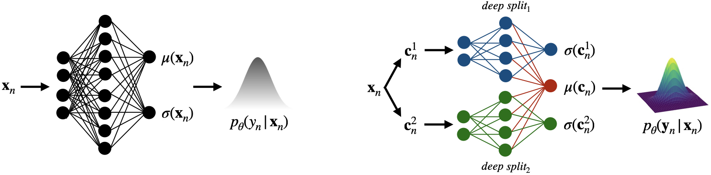
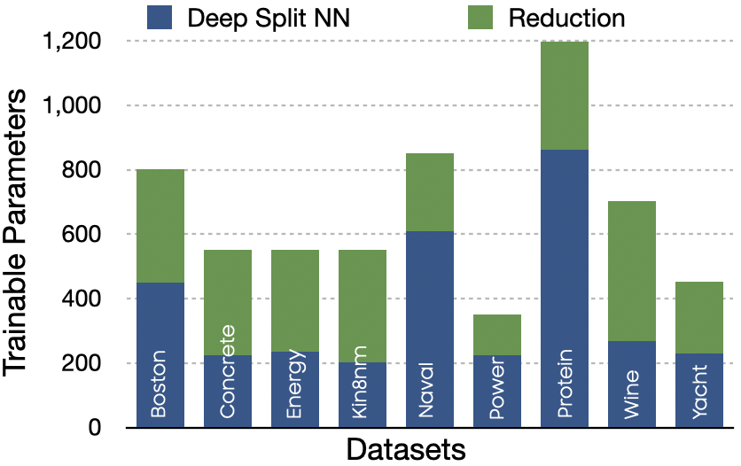
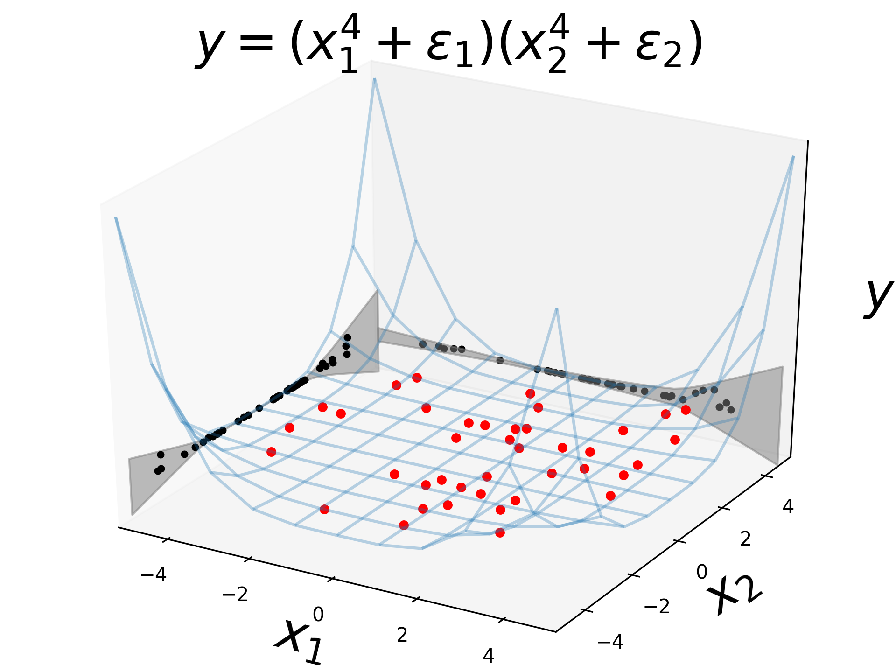

# Why have a Unified Uncertainty? Disentangling it using Deep Split Ensembles

Code for the paper - [https://arxiv.org/abs/2009.12406](https://arxiv.org/abs/2009.12406)

<p align="center">
  
</p>

<p align="center">
  
</p>

### Toy Regression on 3D Problem

The red points are the observed noisy training samples and the black points are their projections on the respective axes. The grey regions show the predicted mean along with three standard deviations. The disentangled uncertainties have different grey regions on the two dimensions, and are able to `contain` the black points well. This illustrates how decomposed uncertainties can capture disentangled information about the individual noise in the input features

<p align="center">
  
  
</p>

## Setup
1. Setup Virtual Environment
```
pip install virtualenv
virtualenv venv
source venv/bin/activate
```
2. Install dependencies
`pip install -r requirements.txt`

3. Run the code

## Run

### Train
```
python main.py train --datasets_dir datasets --dataset boston --model_dir boston_models --verbose 1
```

Check for dataset name mapping [below](#further-notes) 

### Evaluate
```
python main.py evaluate --datasets_dir datasets --dataset boston --model_dir boston_models
```

### Experiments

#### Calibration - Clusterwise OOD
```
python main.py experiment --exp_name clusterwise_ood --plot_path plots --datasets_dir datasets --dataset boston --model_dir boston_models
```

#### Empirical rule test
```
python main.py experiment --exp_name empirical_rule_test --datasets_dir datasets --dataset boston --model_dir boston_models
```

#### Calibration - Defer Simulation
```
python main.py experiment --exp_name defer_simulation --plot_path plots --datasets_dir datasets --dataset boston --model_dir boston_models
```

#### Calibration - KL Divergence vs Mode
```
python main.py experiment --exp_name kl_mode --plot_path plots --datasets_dir datasets --dataset boston --model_dir boston_models
```

#### Toy regression
```
python main.py experiment --exp_name toy_regression --plot_path toy --model_dir toy_models --dataset toy
```

#### Show model parameters
```
python main.py experiment --exp_name show_summary --datasets_dir datasets --dataset boston
```


## Further Notes

### Mapping for regression datasets to `--dataset` flag

1. Boston Housing : boston
2. Concrete : cement
3. Energy Efficiency : energy_efficiency
4. Kin8nm : kin8nm
5. Naval Propulsion Plant : naval
6. Power Plant Output : power_plant
7. Protein Structure : protein
8. Red Wine Quality : wine
9. Yacht Hydrodynamics : yacht
10. Year prediction MSD : msd

### Human experts

Set `--mod_split` flag in all commands to `human`, to access splits created by human experts.
Only available for Power Plant Output and Red Wine Quality

### ADReSS - Compare features extraction

1. Install and setup OpenSmile for Compare features extraction following [COMPARE.md](https://github.com/wazeerzulfikar/ad-mmse/blob/master/COMPARE.md)
2. Extract compare features
